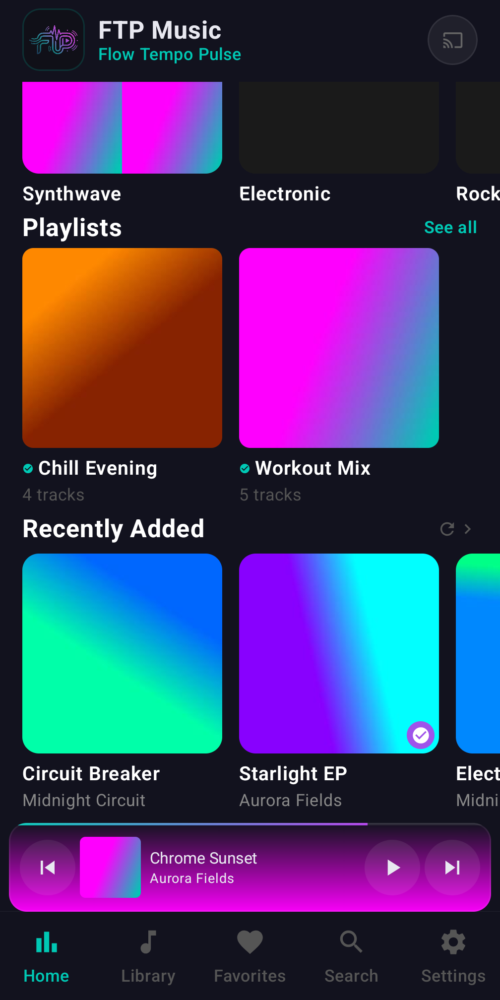
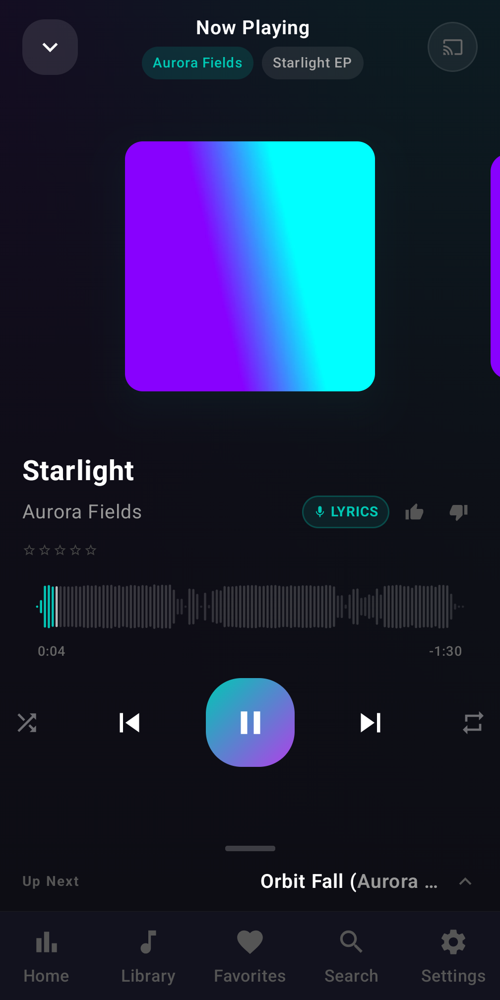
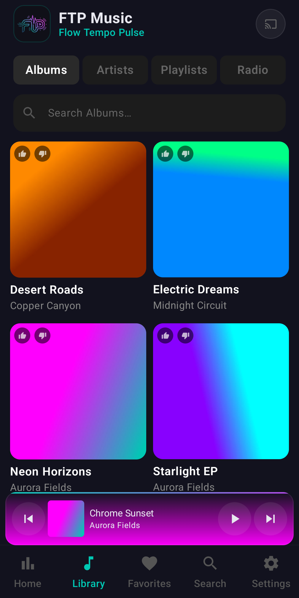

# ftpmusic

Android music player for Subsonic / OpenSubsonic servers (Navidrome, Gonic,
Airsonic-Advanced, …) with Google Cast support and an offline-first local cache.

## Features

- **Local-first library** — Room is the source of truth; the server is mirrored
  in the background for offline use.
- **Streaming cache** — tracks stream to disk as they play (LRU, quota-managed)
  with a download manager for explicit offline saves.
- **Google Cast** — session hand-off, remote queue control, LAN fallback for
  cached tracks.
- **Daily Mixes** — user-managed recipes combining genres, decades and
  artists (AND across dimensions, OR within one), with optional auto-cache.
- **Favorites, playlists, search, lyrics, waveform scrubbing**, queue
  management and a Material 3 Compose UI.
- **Offline mode** — forces playback from downloads + auto-cache.

## Screenshots

| Home | Now Playing | Library |
| --- | --- | --- |
|  |  |  |

## Quick start

### Prerequisites

- JDK 17
- Android SDK (platform 35, build-tools)
- `adb` on PATH for device installs
- A Subsonic-compatible server

### Build and install

```bash
make                # assemble debug APK
make install        # build + install on the connected device
make clean-install  # wipe app data + fresh install
```

### Tests and quality gates

```bash
make test           # unit tests
make test-report    # tests + JaCoCo coverage report
make quality        # ktlintCheck + detekt
make format         # ktlintFormat
```

Install the repository-managed Git hooks once per clone with
`make install-hooks`.

### Debugging

```bash
make logs           # live app logs (filtered)
make ui-logs        # broad logcat with app keywords
make uninstall      # remove from device
```

## Architecture

```
compose/                          # Android Compose app
├── app/src/main/java/.../app/
│   ├── playback/                 # MediaService, CastPlayer, ExoPlayer
│   ├── data/                     # Network, Room DB, sync workers
│   └── ui/                       # Compose screens
└── app/src/test/                 # Unit tests
```

- [CONTEXT.md](CONTEXT.md) — domain glossary (stream vs download, auto-cache,
  daily mixes, cast tiers, …).
- [docs/adr/](docs/adr/) — architectural decision records.
- [docs/BEHAVIOR-MAP.md](docs/BEHAVIOR-MAP.md) — screen and data-flow map.

Server credentials are entered in-app and stored in encrypted shared
preferences; nothing is bundled with the APK.

## Contributing

See [CONTRIBUTING.md](CONTRIBUTING.md). Participation is covered by the
[Code of Conduct](CODE_OF_CONDUCT.md). Security reports: [SECURITY.md](SECURITY.md).

## License

[Apache License 2.0](LICENSE).

## Privacy

See the [privacy policy](PRIVACY.md).
